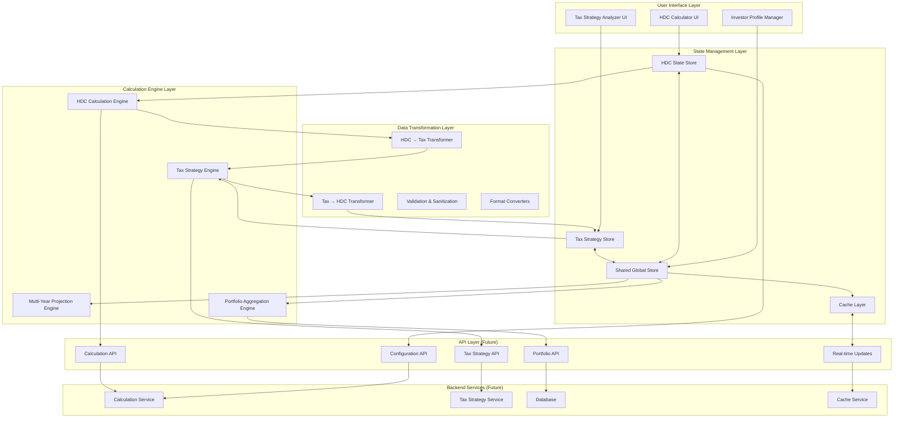

# HDC Calculator → Tax Strategy App Data Flow Architecture

## 1. HIGH-LEVEL DATA FLOW DIAGRAM



## 2. DETAILED DATA PIPELINE: HDC → TAX STRATEGY

### 2.1 Core Data Flow Pipeline

```typescript
// Data Pipeline Structure
interface HDCToTaxPipeline {
  // Stage 1: Extract HDC Results
  hdcResults: {
    investorAnalysis: InvestorAnalysisResults;
    hdcAnalysis: HDCAnalysisResults;
    taxCalculations: TaxCalculationResults;
    cashFlows: CashFlowItem[];
  };

  // Stage 2: Transform for Tax Strategy
  transform(): TaxStrategyInput {
    return {
      // Project basics
      projectId: string;
      projectName: string;
      investmentAmount: number;

      // Tax loss data
      year1TaxLoss: number;
      annualTaxLosses: number[];
      depreciationSchedule: DepreciationItem[];

      // Investor profile
      investorType: 'rep' | 'non-rep';
      federalTaxRate: number;
      stateTaxRate: number;
      passiveIncomeType: 'short-term' | 'long-term';

      // Timing
      holdPeriod: number;
      constructionDelay: number;
      taxBenefitDelay: number;
    };
  }

  // Stage 3: Enrich with Tax-Specific Data
  enrich(data: TaxStrategyInput): EnrichedTaxData {
    return {
      ...data,
      passiveLossLimitations: calculatePassiveLossLimits(data),
      amtAdjustments: calculateAMT(data),
      stateConformityAdjustments: getStateAdjustments(data),
      carryforwardSchedule: projectCarryforwards(data)
    };
  }

  // Stage 4: Generate Tax Strategy
  generateStrategy(data: EnrichedTaxData): TaxStrategy {
    return {
      optimalTiming: calculateOptimalTiming(data),
      lossUtilization: optimizeLossUtilization(data),
      projectedSavings: calculateTaxSavings(data),
      recommendations: generateRecommendations(data)
    };
  }
}
```

### 2.2 Data Transformation Matrix

| HDC Output | Transformation | Tax Strategy Input | Purpose |
|------------|---------------|-------------------|---------|
| year1TaxBenefit | Direct pass + validate | year1TaxLoss | Initial loss for offset |
| annualStraightLineDepreciation | Array mapping | annualTaxLosses[] | Multi-year planning |
| investorCashFlows[] | Extract tax components | taxBenefitTimeline[] | Tax timing optimization |
| effectiveTaxRate | Split federal/state | {federal, state, local} | Jurisdiction-specific planning |
| investorEquity | Calculate percentage | investmentPercentage | Passive loss limitations |
| exitProceeds | Project capital gains | futureGainsLiability | Exit tax planning |
| dscr[] | Risk assessment | investmentRiskScore | Strategy confidence level |

## 3. REAL-TIME VS BATCH DATA UPDATES

### 3.1 Real-Time Updates (< 100ms)
```typescript
interface RealTimeUpdates {
  // Immediate UI synchronization
  triggers: [
    'investorType',      // REP/Non-REP toggle
    'taxRates',          // Federal/State rate changes
    'investmentAmount',  // Investment size changes
    'projectSelection'   // Active project switch
  ];

  // Real-time calculation chain
  updateFlow: {
    userInput: any;
    validation: '<10ms';
    stateUpdate: '<20ms';
    calculation: '<50ms';
    uiRender: '<20ms';
  };

  // WebSocket events (future)
  wsEvents: [
    'marketRateUpdate',
    'taxLawChange',
    'portfolioAlert'
  ];
}
```

### 3.2 Batch Updates (Async)
```typescript
interface BatchUpdates {
  // Deferred calculations
  triggers: [
    'multiYearProjections',  // 10-30 year calculations
    'portfolioAggregation',  // Multiple property analysis
    'scenarioAnalysis',      // What-if scenarios
    'taxOptimization'        // Complex optimization algorithms
  ];

  // Batch processing strategy
  strategy: {
    debounceTime: 500;  // ms
    chunkSize: 100;     // calculations per chunk
    priority: 'user-initiated' | 'background';
    caching: true;
  };

  // Background job queue (future)
  jobQueue: [
    { type: 'RECALC_PORTFOLIO', priority: 2 },
    { type: 'UPDATE_TAX_PROJECTIONS', priority: 3 },
    { type: 'OPTIMIZE_STRATEGY', priority: 1 }
  ];
}
```

## 4. SHARED STATE MANAGEMENT ARCHITECTURE

### 4.1 Global State Store Design
```typescript
// Zustand store for shared state
interface GlobalStore {
  // Shared investor profile
  investor: {
    id: string;
    name: string;
    type: 'individual' | 'entity';
    taxProfile: {
      federalRate: number;
      stateRate: number;
      filingStatus: string;
      repStatus: boolean;
    };
    portfolio: Project[];
  };

  // Active project context
  activeProject: {
    id: string;
    name: string;
    hdcResults: InvestorAnalysisResults | null;
    taxStrategy: TaxStrategy | null;
    lastCalculated: Date;
  };

  // Shared calculations cache
  cache: {
    depreciationSchedules: Map<string, DepreciationSchedule>;
    taxProjections: Map<string, TaxProjection[]>;
    optimization: Map<string, OptimizationResult>;
  };

  // Actions
  actions: {
    updateInvestorProfile: (profile: Partial<InvestorProfile>) => void;
    selectProject: (projectId: string) => void;
    syncHDCResults: (results: InvestorAnalysisResults) => void;
    syncTaxStrategy: (strategy: TaxStrategy) => void;
    clearCache: () => void;
  };
}
```

### 4.2 State Synchronization Pattern
```typescript
// Bidirectional sync between HDC and Tax Strategy
class StateSync {
  // HDC → Tax Strategy sync
  syncFromHDC(hdcState: HDCState): void {
    const taxData = this.transformHDCData(hdcState);
    taxStrategyStore.update(taxData);
    globalStore.cache.invalidate(['taxProjections']);
  }

  // Tax Strategy → HDC sync (for tax optimization feedback)
  syncFromTax(taxState: TaxState): void {
    if (taxState.recommendedChanges) {
      hdcStore.suggestOptimization({
        holdPeriod: taxState.optimalHoldPeriod,
        investmentTiming: taxState.optimalTiming
      });
    }
  }

  // Conflict resolution
  resolveConflicts(hdcUpdate: any, taxUpdate: any): any {
    // HDC Calculator takes precedence for financial data
    // Tax Strategy takes precedence for tax-specific settings
    return {
      ...taxUpdate,
      financials: hdcUpdate.financials,
      timestamp: Date.now()
    };
  }
}
```

## 5. API ENDPOINT REQUIREMENTS (FUTURE BACKEND)

### 5.1 RESTful API Endpoints
```yaml
# Configuration Management
POST   /api/configurations
GET    /api/configurations/{userId}
PUT    /api/configurations/{configId}
DELETE /api/configurations/{configId}

# HDC Calculations
POST   /api/calculate/hdc
  Body: CalculationParams
  Response: InvestorAnalysisResults

# Tax Strategy
POST   /api/tax-strategy/analyze
  Body: TaxStrategyInput
  Response: TaxStrategy

POST   /api/tax-strategy/optimize
  Body: OptimizationParams
  Response: OptimizedStrategy

# Portfolio Management
GET    /api/portfolio/{userId}
POST   /api/portfolio/aggregate
  Body: ProjectId[]
  Response: PortfolioAnalysis

# Multi-Year Projections
POST   /api/projections/calculate
  Body: ProjectionParams
  Response: ProjectionResults[]

# Real-time Updates (WebSocket)
WS     /api/ws/updates
  Events:
    - calculation.progress
    - market.update
    - tax.change
```

### 5.2 GraphQL Schema (Alternative)
```graphql
type Query {
  # Get specific project with calculations
  project(id: ID!): Project

  # Get investor's portfolio
  portfolio(investorId: ID!): Portfolio

  # Get tax strategy for project
  taxStrategy(projectId: ID!): TaxStrategy
}

type Mutation {
  # Run HDC calculations
  calculateHDC(input: HDCInput!): HDCResults!

  # Generate tax strategy
  generateTaxStrategy(input: TaxInput!): TaxStrategy!

  # Save configuration
  saveConfiguration(input: ConfigInput!): Configuration!
}

type Subscription {
  # Real-time calculation updates
  calculationProgress(projectId: ID!): CalculationUpdate!

  # Market data updates
  marketUpdate: MarketData!
}
```

## IMPORTANT: PASSIVE LOSS RULES CLARIFICATION

### Passive Activity Loss Limitations (IRC §469)
```typescript
interface PassiveLossRules {
  // CRITICAL: Passive losses have NO LIMIT when offsetting passive gains
  passiveVsPassive: {
    limit: 'UNLIMITED',
    description: 'Passive losses can offset passive gains without any limitation',
    example: '$1.78M passive loss can offset $1.78M passive gains fully'
  };

  // Passive losses are LIMITED when offsetting ordinary income
  passiveVsOrdinary: {
    generalRule: 'NOT ALLOWED',  // Passive losses cannot offset ordinary income

    specialAllowance: {
      amount: 25_000,  // $25K special allowance for rental real estate
      requirements: [
        'Active participation in rental activity',
        'Own at least 10% of property',
        'Make management decisions'
      ],
      phaseOut: {
        start: 100_000,  // AGI where phase-out begins
        complete: 150_000,  // AGI where allowance reaches $0
        reduction: '$0.50 per dollar of AGI over $100K'
      }
    }
  };

  // Real Estate Professional (REP) exception
  repException: {
    requirement: 'Qualify under IRC §469(c)(7)',
    benefit: 'Rental real estate NOT treated as passive',
    result: 'Can offset ordinary income WITHOUT LIMIT',
    tests: [
      'More than 750 hours in real property trades/businesses',
      'More than 50% of personal services in real property',
      'Material participation in each rental activity'
    ]
  };

  // Carryforward rules
  carryforward: {
    period: 'INDEFINITE',  // No expiration
    usage: 'Applied against future passive income',
    release: 'Fully deductible in year of disposition'
  };
}
```

## 6. SPECIFIC EXAMPLE: $1M WILLOW PROJECT FLOW

### 6.1 Initial Investment Flow
```typescript
// User inputs $1M investment in Willow project
const willowInvestment = {
  projectId: 'willow-001',
  projectName: 'Willow Affordable Housing',
  investmentAmount: 1_000_000,
  timestamp: '2025-01-15T10:00:00Z'
};

// Step 1: HDC Calculator Processing
hdcCalculator.process(willowInvestment) => {
  // Capital structure allocation
  investorEquity: 1_000_000,
  leverageRatio: 7.14,  // Total project $7.14M

  // Year 1 calculations
  year1Depreciation: 1_785_000,  // 25% bonus
  year1TaxBenefit: 855_015,      // @ 47.9% rate
  hdcFee: 85_501,                // 10% of benefit
  netYear1Benefit: 769_514,

  // Cash flow projections
  yearlyNOI: [357_000, 367_710, ...],  // 3% growth
  taxBenefits: [769_514, 61_561, ...], // Depreciation schedule

  // Exit analysis (Year 10)
  exitValue: 6_816_000,
  remainingDebt: 3_200_000,
  exitProceeds: 2_100_000,
  totalReturn: 3_500_000,
  irr: 15.2
};

// Step 2: Data Transformation
dataTransformer.transform(hdcResults) => {
  taxStrategyInput: {
    projectId: 'willow-001',
    investmentAmount: 1_000_000,
    year1TaxLoss: 1_785_000,

    // 10-year tax loss schedule
    taxLossSchedule: [
      { year: 1, loss: 1_785_000, benefit: 855_015 },
      { year: 2, loss: 142_857, benefit: 68_401 },
      // ... years 3-10
    ],

    investorProfile: {
      type: 'rep',  // Real Estate Professional
      federalRate: 37,
      stateRate: 10.9,
      hasPassiveIncome: false
    }
  }
};

// Step 3: Tax Strategy Analysis
taxStrategyEngine.analyze(taxStrategyInput) => {
  strategy: {
    // Immediate utilization (REP status)
    year1Savings: 855_015,

    // Multi-year optimization
    totalTaxSavings: 1_247_842,
    effectiveInvestment: -247_842,  // Free investment achieved

    // Recommendations
    recommendations: [
      'Consider 1031 exchange at exit to defer $420K recap',
      'Pair with solar credits for additional 30% benefit',
      'Hold minimum 5 years for optimal tax efficiency'
    ],

    // Risk analysis
    risks: [
      'REP status must be maintained',
      'State conformity may reduce benefits 20%',
      'AMT exposure above $200K income'
    ]
  }
};

// Step 4: Update Both UIs
uiUpdater.sync({
  hdcCalculator: {
    showResults: true,
    highlight: ['irr', 'freeInvestmentAchieved']
  },
  taxStrategy: {
    showSavings: true,
    showTimeline: true,
    enableOptimization: true
  }
});
```

### 6.2 Real-time Update Example
```typescript
// User changes from REP to Non-REP status
onInvestorTypeChange('non-rep') => {
  // Immediate recalculation
  realTimeUpdate: {
    // For Non-REP with passive gains to offset
    passiveGainsOffset: {
      availablePassiveLosses: 1_785_000,  // Full depreciation available
      passiveGainsToOffset: 500_000,       // User's passive gains
      netTaxBenefit: 239_500,              // 500K × 47.9% rate
      excessLossCarryforward: 1_285_000    // Remaining for future passive gains
    },

    // For Non-REP with only ordinary income
    ordinaryIncomeOffset: {
      allowance: 25_000,  // $25K special allowance (phases out at high income)
      phaseOutStart: 100_000,  // AGI level where phase-out begins
      phaseOutComplete: 150_000,  // AGI level where allowance is $0
      year1Benefit: 11_975,  // 25K × 47.9% (if under phase-out)
      carryforward: 1_760_000  // Excess carries forward for passive income
    },

    // Strategy changes
    newRecommendations: [
      'Generate passive income to fully utilize $1.78M in losses',
      'Consider REP election for unlimited ordinary income offset',
      'Passive losses never expire - carry forward indefinitely',
      'Pair with other passive income investments'
    ],

    // Impact on returns (depends on passive income availability)
    withPassiveIncome: {
      adjustedIRR: 14.8,  // Slightly lower than REP
      timeToFreeInvestment: 6.5  // Years
    },
    withoutPassiveIncome: {
      adjustedIRR: 10.2,  // Significant reduction
      timeToFreeInvestment: 12  // Years (relies on exit gains)
    }
  };

  // UI updates in <100ms
  updateTime: 87;  // ms
};
```

## 7. MULTI-YEAR PROJECTION CALCULATION FLOW

### 7.1 Calculation Location & Responsibility
```typescript
interface ProjectionArchitecture {
  // HDC Calculator handles
  hdcProjections: {
    location: 'HDC Calculation Engine',
    calculates: [
      'Annual NOI growth',
      'Debt service schedules',
      'Cash flow waterfall',
      'Exit proceeds',
      'IRR/Multiple'
    ],
    outputFormat: 'CashFlowItem[]'
  };

  // Tax Strategy handles
  taxProjections: {
    location: 'Tax Strategy Engine',
    calculates: [
      'Annual tax losses',
      'Passive loss carryforwards',
      'AMT adjustments',
      'State tax variations',
      'After-tax returns'
    ],
    outputFormat: 'TaxProjection[]'
  };

  // Shared Projection Engine handles
  combinedProjections: {
    location: 'Multi-Year Projection Engine',
    calculates: [
      'After-tax cash flows',
      'Portfolio aggregation',
      'Scenario comparisons',
      'Optimization paths'
    ],
    outputFormat: 'IntegratedProjection[]'
  };
}
```

### 7.2 Multi-Year Calculation Example
```typescript
// 10-Year projection for Willow project
multiYearProjection.calculate({
  project: 'willow-001',
  years: 10
}) => {
  projections: [
    {
      year: 1,
      hdc: { noi: 357_000, cashFlow: 85_000, debt: 4_200_000 },
      tax: { loss: 1_785_000, benefit: 855_015, carryforward: 0 },
      combined: { afterTaxCF: 940_015, cumulative: 940_015 }
    },
    {
      year: 2,
      hdc: { noi: 367_710, cashFlow: 95_000, debt: 4_150_000 },
      tax: { loss: 142_857, benefit: 68_401, carryforward: 0 },
      combined: { afterTaxCF: 163_401, cumulative: 1_103_416 }
    },
    // ... years 3-10
    {
      year: 10,
      hdc: { noi: 465_239, cashFlow: 2_100_000, debt: 0 },
      tax: { loss: 0, benefit: 0, gainsTax: -420_000 },
      combined: { afterTaxCF: 1_680_000, cumulative: 3_080_000 }
    }
  ],

  summary: {
    totalInvestment: 1_000_000,
    totalPreTaxReturn: 3_500_000,
    totalTaxBenefit: 1_247_842,
    totalTaxOnExit: -420_000,
    netAfterTaxReturn: 3_327_842,
    afterTaxIRR: 14.8
  }
};
```

## 8. INVESTOR PROFILE CHANGE IMPACTS

### 8.1 Profile Change Cascade
```typescript
interface ProfileChangeImpact {
  // Change: Federal tax rate 37% → 24%
  onFederalTaxChange: {
    hdcCalculator: {
      // Immediate updates
      effectiveTaxRate: 34.9,  // Down from 47.9%
      year1TaxBenefit: 622_965,  // Down from 855_015
      hdcFee: 62_296,  // Down from 85_501

      // No change to cash flows or IRR
      irr: 15.2  // Unchanged
    },

    taxStrategy: {
      // Cascading updates
      totalTaxSavings: 910_000,  // Down from 1_247_842
      breakEvenYear: 7.8,  // Up from 6.2
      recommendations: [
        'Lower bracket reduces depreciation value',
        'Consider timing income to higher years',
        'Charitable deduction more valuable at 37%'
      ]
    }
  };

  // Change: REP → Non-REP status
  onREPStatusChange: {
    hdcCalculator: {
      // No immediate HDC changes
      changes: null
    },

    taxStrategy: {
      // Strategy shift depends on income type
      passiveIncomeScenario: {
        // No limit on offsetting passive gains
        passiveLossesAvailable: 1_785_000,  // Full amount
        passiveGainsOffset: 'unlimited',     // Can offset all passive gains
        strategy: 'Match passive income sources to loss timing'
      },

      ordinaryIncomeScenario: {
        // Limited to $25K special allowance
        ordinaryIncomeOffset: 25_000,  // Annual limit
        phaseOutRange: [100_000, 150_000],  // AGI phase-out
        excessCarryforward: 1_760_000,  // Carries forward
        utilizationYears: 'Until passive income generated'
      },

      recommendations: [
        'Passive losses offset passive gains WITHOUT LIMIT',
        'Only $25K can offset ordinary income (with phase-out)',
        'Consider investments generating passive income',
        'REP status allows unlimited ordinary income offset'
      ]
    }
  };

  // Change: Add state tax (0% → 10.9% NY)
  onStateChange: {
    hdcCalculator: {
      effectiveTaxRate: 47.9,  // Up from 37%
      year1TaxBenefit: 855_015,  // Increased
      stateConformity: 'partial'  // NY consideration
    },

    taxStrategy: {
      stateTaxSavings: 194_565,
      conformityAdjustment: -38_913,  // 20% reduction
      stateSpecificRules: [
        'NY limits bonus depreciation',
        'State AMT calculation required',
        'City tax additional 3.876%'
      ]
    }
  };
}
```

### 8.2 Profile Synchronization Flow
```typescript
// Centralized profile update handler
class ProfileSyncManager {
  updateProfile(changes: ProfileChanges): void {
    // Step 1: Update global store
    globalStore.investor.update(changes);

    // Step 2: Trigger HDC recalculation
    hdcCalculator.recalculate({
      trigger: 'profile_change',
      changes: changes,
      priority: 'high'
    });

    // Step 3: Trigger tax strategy recalculation
    taxStrategy.recalculate({
      trigger: 'profile_change',
      changes: changes,
      priority: 'high'
    });

    // Step 4: Update all active projects
    portfolio.projects.forEach(project => {
      project.markStale();
      project.scheduleRecalculation();
    });

    // Step 5: Notify UI components
    eventBus.emit('profile_updated', {
      changes: changes,
      impact: this.assessImpact(changes),
      timestamp: Date.now()
    });
  }

  assessImpact(changes: ProfileChanges): Impact {
    return {
      severity: this.calculateSeverity(changes),
      affectedCalculations: this.getAffectedCalcs(changes),
      estimatedRecalcTime: this.estimateTime(changes),
      userNotification: this.generateNotification(changes)
    };
  }
}
```

## 9. PERFORMANCE & OPTIMIZATION STRATEGIES

### 9.1 Caching Strategy
```typescript
interface CacheArchitecture {
  // Level 1: Memory cache (React Query / Zustand)
  memoryCache: {
    ttl: 300_000,  // 5 minutes
    maxSize: '50MB',
    keys: [
      'hdcResults:{projectId}',
      'taxStrategy:{projectId}',
      'projections:{projectId}:{years}'
    ]
  };

  // Level 2: IndexedDB (large datasets)
  indexedDB: {
    ttl: 86_400_000,  // 24 hours
    maxSize: '500MB',
    keys: [
      'portfolioAnalysis:{userId}',
      'historicalCalculations',
      'savedConfigurations'
    ]
  };

  // Level 3: Backend cache (Redis - future)
  redis: {
    ttl: 3_600_000,  // 1 hour
    keys: [
      'marketData',
      'taxRates:{year}',
      'deprecitionSchedules'
    ]
  };
}
```

### 9.2 Optimization Techniques
```typescript
interface OptimizationStrategies {
  // Calculation optimization
  memoization: {
    functions: ['calculateIRR', 'calculateNPV', 'projectCashFlows'],
    keyStrategy: 'JSON.stringify(params)',
    maxEntries: 1000
  };

  // Batch processing
  batching: {
    multiProject: 'Web Worker pool',
    largePortfolio: 'Chunked processing',
    scenarioAnalysis: 'Parallel execution'
  };

  // Lazy loading
  lazyLoad: {
    components: ['TaxStrategyDetails', 'PortfolioAnalyzer'],
    data: ['historicalData', 'marketComparisons'],
    calculations: ['whatIfScenarios', 'monteCarlo']
  };

  // Debouncing
  debounce: {
    userInput: 300,  // ms
    recalculation: 500,  // ms
    apiCalls: 1000  // ms
  };
}
```

## 10. ERROR HANDLING & DATA VALIDATION

### 10.1 Validation Pipeline
```typescript
interface ValidationPipeline {
  // Input validation
  validateInput(data: any): ValidationResult {
    return {
      isValid: this.checkRanges(data) && this.checkTypes(data),
      errors: this.collectErrors(data),
      warnings: this.collectWarnings(data),
      sanitized: this.sanitize(data)
    };
  }

  // Cross-system validation
  validateConsistency(hdcData: any, taxData: any): ConsistencyResult {
    return {
      taxRateMatch: hdcData.effectiveTaxRate === taxData.combinedRate,
      investmentMatch: hdcData.investorEquity === taxData.investmentAmount,
      timelineMatch: hdcData.holdPeriod === taxData.projectionYears
    };
  }

  // Business rule validation
  validateBusinessRules(data: any): RuleResult {
    return {
      dcsrMinimum: data.dscr >= 1.05,
      capitalStructure: data.totalCapital === 100,
      hdcInvestment: data.hdcInitialInvestment === 0
    };
  }
}
```

## IMPLEMENTATION ROADMAP

### Phase 1: Foundation (Weeks 1-2)
- Implement shared state store (Zustand)
- Create data transformation layer
- Build basic pipeline HDC → Tax Strategy

### Phase 2: Real-time Integration (Weeks 3-4)
- Add real-time update handlers
- Implement caching layer
- Create profile sync manager

### Phase 3: Advanced Features (Weeks 5-6)
- Multi-year projection engine
- Portfolio aggregation
- Scenario analysis tools

### Phase 4: Backend Preparation (Weeks 7-8)
- Define API contracts
- Create mock API services
- Prepare for backend migration

### Phase 5: Optimization (Weeks 9-10)
- Performance tuning
- Add Web Workers for heavy calculations
- Implement advanced caching strategies